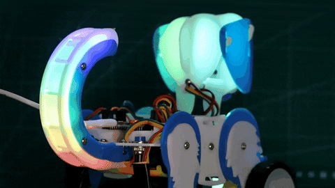
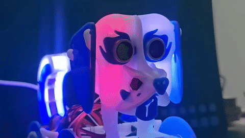
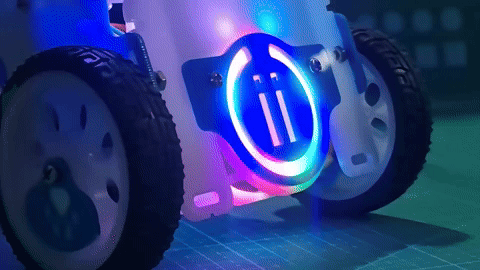
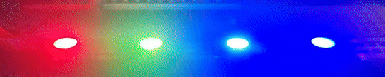
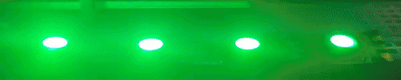
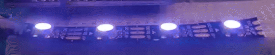
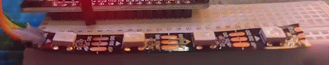
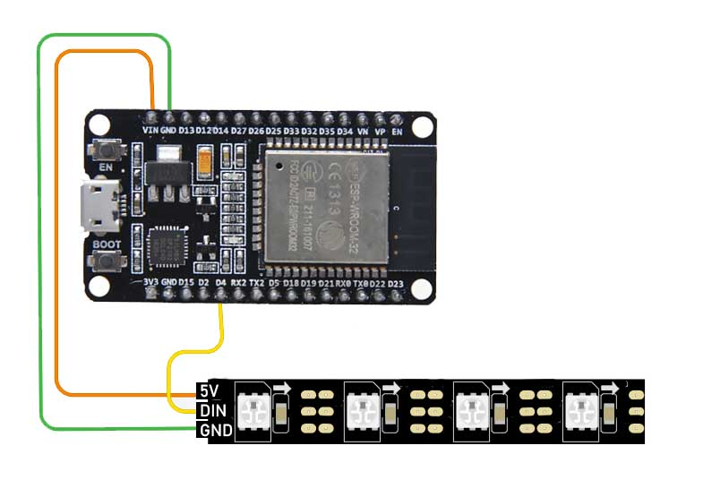
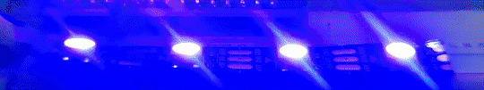
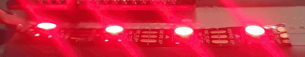

# ii_LedArray Library for WS2812 LED Strips

The ii_LedArray library is a comprehensive and versatile software solution designed for controlling WS2812 LED strips using ESP32 microcontrollers. It offers a wide range of features that cater to both basic and advanced LED strip manipulation, making it suitable for hobbyists, artists, and engineers alike.

```cpp
#include <ii_LedArray.h>

ii_LedArray ledarray = ii_LedArray(GPIO_pin, LEDs_count);  // Initialize
```

|  |  |
|:--------------------------------------------------------------:|:--------------------------------------------------------------:|
|  |  |

## Key Features:

1. **Dynamic Control**: Control individual LEDs or the entire strip with ease. Set specific colors to LEDs or create vibrant patterns across the strip.

      ```cpp
      ledarray.setColor(index, color); // Set the color of a specific LED.
      ledarray.setColor(index, red, green, blue); // Set the color of a specific LED using RGB values.

      // Setting color without specifying an index applies to the entire strip.
    
      ledarray.setColor(color); // Set the color of all LEDs.
      ledarray.setColor(red, green, blue); // Set the color of all LEDs using RGB values.
      ```
      

2. **Color Transitions**: Implement smooth color transitions over time. This feature allows for visually appealing effects, ideal for creating mood lighting, visual alarms, or enhancing aesthetic projects.
      ```cpp
      start_time = millis() + 100; // Set transition to start after 100 milliseconds.
      duration = 1000; // Transition will last for 1000 milliseconds.

      ledarray.setColorTrans(index, color, start_time, duration); 
      ledarray.setColorTrans(index, red, green, blue, start_time, duration);

      // Setting color transitions without an index applies the effect to the entire strip.
      ledarray.setColorTrans(color, start_time, duration);
      ledarray.setColorTrans(red, green, blue, start_time, duration);

      ```
      

3. **Brightness Management**: Adjust the brightness of the entire strip or individual LEDs, providing flexibility in creating the desired lighting effect while managing power consumption.
      ```cpp
      ledarray.setBrightness(int bright); // Set brightness (0-100)
      ```
      

4. **Test Functions**: Includes built-in test functions to validate the functionality of the LED strip. This helps in quick troubleshooting and verification.
      ```cpp
      ledarray.test();               // Test the LED strip with RED, GREEN, BLUE
      ledarray.testColors();         // Test the LED strip with all available colors
      ledarray.testColors(bool dir); // Create a pattern with all available colors and shift it
      ```
      

5. **Pattern Shifting**: Move colors across the strip in a specified direction, enabling dynamic and engaging light movements, which can be synchronized with events, music, or actions.
      ```cpp
      //loop
        ledarray.move(true);
        ledarray.update();
      ```
      

6. **Real-time Updates**: The library supports real-time updates to the LED strip, ensuring immediate reflection of changes in lighting patterns or colors.

7. **Efficient Memory Management**: Dynamic allocation and deallocation of memory for pixel data ensure efficient use of resources, crucial for microcontroller-based projects.

8. **Extensible Design**: Structured to be easily extendable for future enhancements, whether for personal projects or broader community contributions.

## Use Cases:

- **Home Automation**: Integrating LED strips into home automation for mood lighting, notifications, or aesthetic enhancements.
- **Event Decorations**: Creating dynamic and programmable lighting setups for events, parties, or festive occasions.
- **Interactive Art Installations**: Developing interactive art pieces where lighting plays a crucial role.
- **Educational Purposes**: Teaching the basics of LED control, programming, and microcontroller interaction.

## Getting Started:

This library is designed for ease of use. Simply include the `ii_LedArray.h` header in your Arduino sketch, initialize the library with your LED strip specifications, and you're ready to bring your LED projects to life.

Whether you're a seasoned developer or a hobbyist starting with LEDs, the ii_LedArray library offers the functionality and ease of use to bring your lighting ideas to fruition.


### Installation for Arduino IDE

1. **Download the Library**:
   - Navigate to the `ii_LedArray` GitHub repository at [ii-lk/ii_LedArray](https://github.com/ii-lk/ii_LedArray.git).
   - Click on the "Code" button and select "Download ZIP".

2. **Install in Arduino IDE**:
   - Open the Arduino IDE.
   - Go to `Sketch` > `Include Library` > `Add .ZIP Library...`.
   - Navigate to the downloaded ZIP file and select it. The IDE will install the library.

3. **Include the Library in Your Project**:
   - In your Arduino sketch, go to `Sketch` > `Include Library` and select `ii_LedArray`.
   - This adds the necessary `#include` statements to your sketch.

### Installation for Visual Studio Code with PlatformIO

Both methods for Visual Studio Code with PlatformIO offer effective ways to include the `ii_LedArray` library in your projects. The first method gives you manual control over the library files, while the second method automates the dependency management through PlatformIO.

#### Method 1: Download and Copy to Lib Folder

1. **Clone the Repository**:
   - Open Visual Studio Code.
   - Open the integrated terminal (`Terminal` > `New Terminal`).
   - Clone the repository by executing:
     ```
     git clone https://github.com/ii-lk/ii_LedArray.git
     ```
   - This downloads the library into a folder named `ii_LedArray`.

2. **Copy the Library to Your Project**:
   - In PlatformIO, open your project.
   - Manually copy the `ii_LedArray` folder into the `lib` directory of your PlatformIO project.

#### Method 2: Use `lib_deps` in `platformio.ini`

1. **Edit `platformio.ini`**:
   - Open your PlatformIO project in Visual Studio Code.
   - Locate the `platformio.ini` file in the root of your project.

2. **Add Library Dependency**:
   - Add the following line under the `[env]` section of your `platformio.ini` file:
     ```
     lib_deps = https://github.com/ii-lk/ii_LedArray.git
     ```
   - This tells PlatformIO to automatically download and manage the `ii_LedArray` library as a dependency.

### Usage

After installation, include the library in your project by adding `#include <ii_LedArray.h>` at the beginning of your code. Ensure to check the library's documentation for detailed usage instructions and example code.

To use the `ii_LedArray` library in your Arduino sketches, include it at the top of your code:
```cpp
#include <ii_LedArray.h>
```

## Wiring Diagram

Below is the wiring diagram to help you set up your hardware. Connect your WS2812 LED strip to the ESP32 as follows:

- **5V** from the LED strip to the **VIN** pin on the ESP32.
- **GND** from the LED strip to the **GND** pin on the ESP32.
- **DIN** (Data Input) from the LED strip to the **D4** pin on the ESP32.




## Examples

### Basic LED Control



This sketch illustrates the use of ii_LedArray library functions to alternate colors on an LED array. It showcases initializing the LED array, setting individual LED colors, and updating the display in a simple and efficient manner. Functions demonstrated include begin() for initialization, setColor() for color assignment, and update() to apply changes to the LED array.

```cpp
#include <ii_LedArray.h>

ii_LedArray ledarray = ii_LedArray(4, 6);  // Initialize the LED array on pin 4 with 6 LEDs

void setup() {
  ledarray.begin();      // Initialize the LED strip
}

void loop() {
    ledarray.setColor(0, 255, 0, 0);  // Set color of LED at index 0 to red
    ledarray.setColor(1, 0, 0, 255);  // Set color of LED at index 1 to blue
    ledarray.update();                  // Update the strip to apply the color change
    delay(100); 

    ledarray.setColor(0, 0, 0, 255);  // Set color of LED at index 1 to blue
    ledarray.setColor(1, 255, 0, 0);  // Set color of LED at index 2 to red
    ledarray.update();                  // Update the strip to apply the color change
    delay(100); 
}
```

### LED Color Toggle : smooth transitions
 


LED Color Toggle: Demonstrates toggling all LEDs between red and blue every second, using ii_LedArray for smooth transitions and color updates.

```cpp
#include <ii_LedArray.h>  // Include the ii_LedArray library

// Initialize an LED array on pin 4 with 6 LEDs
ii_LedArray ledarray = ii_LedArray(4, 6);

long ltime;        // Variable to store the last time the LED colors were updated
bool colorselect;  // Boolean flag to toggle between red and blue colors

void setup() {
  ledarray.begin();            // Initialize the LED strip
}

void loop() {
  // Check if 1000 milliseconds (1 second) have passed since the last update
  if (millis() - ltime > 1000) {
    ltime = millis();  // Update the last time variable to the current time

    // Toggle the entire LED array between red and blue every second
    if (colorselect) {
        ledarray.setColorTrans(255, 0, 0, millis(), 1000); // Set all LEDs to red
    } else {
        ledarray.setColorTrans(0, 0, 255, millis(), 1000); // Set all LEDs to blue
    }

    colorselect = !colorselect;  // Toggle the colorselect flag
  }

  ledarray.update();  // Update the LED array with the new color data
}
```


### LED Ripple Effect : smooth transitions 


Create a ripple effect across LEDs, sequentially shifting colors with time delays, showcasing dynamic and visually appealing patterns.

```cpp
#include <ii_LedArray.h>  // Include the ii_LedArray library

// Initialize an LED array on pin 4 with 6 LEDs
ii_LedArray ledarray = ii_LedArray(4, 6);

long ltime;        // Variable to store the last time the LED color was updated
bool colorselect;  // Boolean flag to toggle between colors

void setup() {
  ledarray.begin();            // Initialize the LED strip
}

void loop() {
  // Check if 1000 milliseconds (1 second) have passed since the last update
  if (millis() - ltime > 1000) {
    ltime = millis();  // Update the last time variable to the current time

    // Toggle between red and blue colors every second for each LED in a sequence
    if (colorselect) {
      // Sequentially set each LED to red (RGB: 255, 0, 0) with staggered timing
      for(int n = 0; n < 4; n++){
        ledarray.setColorTrans(n, 255, 0, 0, millis() + (n * 100), 400);
      }
    } else {
      // Sequentially set each LED to blue (RGB: 0, 0, 255) with staggered timing
      for(int n = 0; n < 4; n++){
        ledarray.setColorTrans(n, 0, 0, 255, millis() + (n * 100), 400);
      }
    }

    colorselect = !colorselect;  // Toggle the colorselect flag
  }

  ledarray.update();  // Update the LED array with the new color data
}
```

## Example Sketches

Below is a list of the example sketches available. Click on an example to view the source code.

- [`Strip Test`](examples/ledarray_01_StripTest.ino) - Tests the LEDs on the strip by cycling through colors.
- [`Write Color`](examples/ledarray_02_WriteColor.ino) - Demonstrates how to set a single LED to a specific color.
- [`Write Color All`](examples/ledarray_03_WriteColorAll.ino) - Shows how to set the entire strip to a uniform color.
- [`Write Color Loop`](examples/ledarray_04_WriteColorLoop.ino) - Loops through colors on the strip.
- [`Brightness Loop`](examples/ledarray_04_BrightnessLoop.ino) - Cycles through different brightness levels.
- [`Library Basic Test`](examples/ledarray_06_LibraryBasicTest.ino) - Checks basic functionality of the library.
- [`Move Rainbow`](examples/ledarray_07_MoveRainbow.ino) - Creates a moving rainbow effect across the strip.
- [`Blur Colors`](examples/ledarray_08_BlurColors.ino) - Softens the transitions between colors.
- [`Blur Color Loop`](examples/ledarray_09_BlurColorLoop.ino) - Applies a blurring effect in a loop.
- [`Multi Strips`](examples/ledarray_10_MultiStrips.ino) - Manages multiple LED strips at once.
- [`Multi Functions`](examples/ledarray_11_MultiFunctions.ino) - Combines several functions to create complex effects.
 

 
## Contributing
We welcome contributions to enhance the `ii_LedArray` library. Feel free to fork the repository, make your changes, and submit a pull request.

## License
This project is licensed under the GNU Lesser General Public License v3.0 (LGPL-3.0) - see the [LICENSE](LICENSE) file for details. The LGPL-3.0 is a popular open-source license that allows for both private and commercial use while ensuring that improvements to the library itself remain open-source. This license permits linking the `ii_Timer` library with other software that might not be under the LGPL, providing flexibility for a wide range of applications.